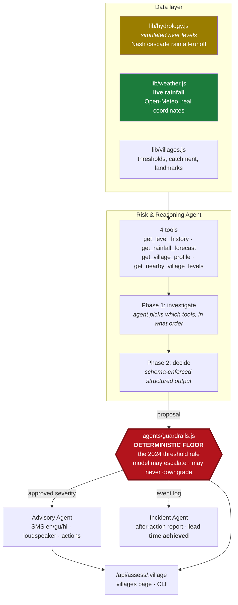

<div align="center">

# 🌊 FloodSense AI

### One repository. Two and a half years apart. A college demo that grew up.

**April 2024** — `Math.random()` behind a page promising *"advanced algorithms and predictive models."*
**September 2026** — Three AI agents that forecast the flood, write the warning in three languages, and **physically cannot talk a real emergency down.**

<br>


</div>

---

## The receipt

I did not rewrite history. The 2024 code is still in the git log, and here is exactly what changed:

```diff
- // views/home.ejs — April 2024. This was the entire "prediction engine".
- const waterLevel = Math.floor(Math.random() * (221 - 130)) + 130;
- updateStatus(waterLevel);                         // ...applied to ALL 7 villages
- setInterval(() => updateStatus(newRandom()), 9000);
```
```js
// agents/orchestrator.js — 2026. The agent investigates, then the guardrail decides.
const { proposed } = await assessRisk(villageId, dataSource);
const { assessment, floor, interventions } = applyGuardrails(villageId, reading, proposed);

// → EVACUATE · 4.2h to danger level · confidence 0.81
//   "Level 148cm rising 14cm/hr with 115mm forecast into a 3-hour-response
//    catchment. Threshold rule alone still reads NORMAL. Bhangarh has hours."
```

| | **The college project (2024)** | **FloodSense AI (2026)** |
|---|---|---|
| Water levels | `Math.random()`, one number for all 7 villages | Per-village hydrograph, Nash cascade rainfall-runoff |
| Prediction | None. A `>=` against a constant | Agent forecasts peak + **hours to breach** |
| Weather | Hardcoded `Temperature: 31°C` in HTML | **Live** Open-Meteo, real coordinates |
| The alert | A dot changed colour | SMS in **en/gu/hi** + loudspeaker script + actions |
| Safety | — | Deterministic floor an LLM cannot override |
| Evidence | — | 24 labelled evals, 11 tests, per-run cost traces |
| Auth | Every visitor shared one login 😬 | Real per-session state |
| README | *(none)* | You're reading it |

---

## Why this problem

Every monsoon, villages on India's rivers flood with no useful warning. The water arrives, and people find out because it is at their door.

The gap is rarely the data. It is that nobody turns a rising gauge reading into *"Mangarh has about four hours — tell them to move to the Dhrangadhra road overbridge"* fast enough, in a language the village actually reads, at three in the morning.

That is the gap this closes. It is also the gap nineteen-year-old me thought I had closed, which is the more interesting half of the story.

---

## What actually happened in 2024

I built `flood-alert-pe-vgec` (this repository's original name) for the VGEC Project Exhibition. Two intense weeks in April 2024, 37 commits, then nothing for two and a half years.

Its About page claimed the system used *"advanced algorithms and predictive models"* to *"anticipate when water levels are likely to rise to dangerous levels,"* with alerts reaching people *"through mobile phones, sirens, and community loudspeakers."*

**None of that existed.** One random number, re-rolled in the browser every nine seconds, applied to all seven villages simultaneously — so every village always showed the *identical* level and only the thresholds differed. No model. No sensor. No history. And the entire alerting mechanism was the colour of a dot on a web page a villager was never going to have open.

I was nineteen. I didn't know the difference between a system and a mock-up wearing a system's vocabulary.

**This repo is that project finished honestly.** The threshold rule I wrote in 2024 is still running — it is now the safety floor the AI is *not permitted* to overrule. The overclaiming is gone, replaced by [a table below](#what-is-real-and-what-is-not) that states plainly which inputs are real and which are simulated.

---

## Architecture



| Agent | Job | Returns |
|---|---|---|
| **Risk & Reasoning** | Investigate with tools, then forecast: is this village heading for trouble, and how long do they have? | severity · confidence · predicted peak · **hours to breach** · reasoning · data-quality concerns |
| **Advisory** | Write the alert people actually receive | SMS in English/Gujarati/Hindi (≤160 chars) · loudspeaker script · prioritised actions naming real local landmarks |
| **Incident** | After the event, write it up for the district office | timeline · peak level · **lead time achieved** · recommendations |

The Risk agent is genuinely agentic, not a prompt with a job title. It gets a village name and four instruments — not a finished report — and decides what to examine: usually the profile first (thresholds are meaningless without knowing the catchment), then the trend, then the rain forecast if the river is rising, then the neighbours if the rain is regional. Every call sequence lands in the trace.

---

## 🛡️ The part worth reading: the guardrail

An LLM is genuinely good at the thing the 2024 system could not do at all — looking at a trend, the rain still to come, and the shape of a catchment, and saying *"this crosses the danger line in about five hours."* That anticipation buys lead time, and lead time is the only thing this system is actually for.

But it is a probabilistic component in a system where a false negative means somebody drowns. So it is wired in as an **advisor, not an authority**:

```js
// agents/guardrails.js — my 2024 rule, still running, now as the safety floor
function deterministicSeverity(village, levelCm) {
  if (levelCm >= village.peakLevelCm)                    return 'EVACUATE';
  if (levelCm >= village.peakLevelCm - WARNING_BAND_CM)  return 'WARNING';
  return 'NORMAL';
}
```

- The deterministic check runs **first and independently**. If the river is over the danger mark, severity is `EVACUATE`. No model output talks that back down, however confident or well-argued.
- The model may only ever **raise** the floor — warning earlier than the rule could have.
- API down, slow, malformed JSON, or no key at all? The system **falls back to the 2024 rule and keeps running.** A flood warning system that goes dark because a vendor had an outage is worse than one running on simpler rules.
- Every intervention is logged, so *"how often did the model try to downgrade a real flood?"* is a number, not a hope.

### The bug that taught me the most

One ordering subtlety, found by a failing test: **repair before you validate.**

Schema validation is all-or-nothing. With validation running first, a `confidence` of `1.02` — a rounding artefact on an otherwise perfect assessment — failed the schema, dropped to the deterministic fallback, and **threw away a genuine `EVACUATE` escalation on a physically calm river.** Exactly the early warning the whole AI layer exists to produce, lost over a cosmetic field.

The rule: *a field you can obviously fix must never cost you a warning.* Fix it, log that you did, then validate what remains. There is a regression test named for this.

```
$ npm test
ok 1 - deterministic floor reproduces the 2024 threshold rule
ok 2 - a model downgrade below the physical floor is refused
ok 3 - every downgrade across every tier pair is refused
ok 4 - the model may escalate freely — that is the point of having it
ok 5 - a missing model response falls back to the threshold rule
ok 6 - a malformed model response is rejected, not partially trusted
ok 7 - the deterministic fallback is itself a valid assessment
ok 8 - an already-breached river cannot be "4 hours from breaching"
ok 9 - out-of-range confidence is repaired, not treated as a fatal error
ok 10 - a repairable field never costs us a real escalation
ok 11 - a clean agreement between model and floor produces no interventions
# pass 11
```

---

## 📊 Evals

*"The AI makes it better"* is a hypothesis, not a claim. The 2024 threshold rule is a real system that gets a majority of these scenarios right **for free, instantly, forever.** If the agent can't beat it by enough to justify its latency and cost, the honest conclusion is to ship the rule and delete the agent.

`evals/scenarios.json` holds **24 hand-labelled scenarios** — flash floods, slow delta rises, cloudbursts over calm rivers, receding-but-still-dangerous, and four bad-data cases (a stuck gauge, an electrical spike, an impossible step change, heavy rain with no river response).

**Measured baseline — the 2024 rule alone** (`npm run evals:baseline`, free, no API key):

| Metric | 2024 threshold rule |
|---|---|
| Accuracy | **58.3%** (14/24) |
| Under-called | 10 |
| Over-called | 0 |
| **Missed evacuations** | **3 of 7 life-critical — 42.9%** |
| Bad-data cases caught | **0 of 4** |

```
  expected \ predicted      NORMAL     WATCH   WARNING  EVACUATE
  NORMAL                       [5]         .         .         .
  WATCH                          5         .         .         .
  WARNING                        2         .       [5]         .
  EVACUATE                       2         .         1       [4]
```

Those **three missed evacuations are the entire argument for the AI layer.** They are scenarios where the river is *below* its danger level right now — so the threshold rule sees nothing — while a cloudburst dumps 130 mm onto a catchment that responds in four hours.

The rule is not malfunctioning. It is right about the present and blind to the future. **A flood warning that arrives with the water is not a warning.**

### The metric that matters

Accuracy alone is the wrong thing to optimise, because the errors are not symmetric:

> Calling `EVACUATE` on a calm river costs **credibility**.
> Calling `NORMAL` on a river about to take a village costs **lives**.

So the harness reports **missed evacuations separately**, and treats a run with better accuracy but a worse missed-evacuation rate as a regression, not an improvement.

> [!NOTE]
> **The agent row is deliberately blank.** I don't publish numbers I haven't measured, and the full run needs an `ANTHROPIC_API_KEY`. Run `npm run evals` — the harness prints both rows side by side with a verdict and writes `evals/results.json`. Budget ~$0.30–0.90 for 24 scenarios on `claude-opus-5`.

---

## What is real and what is not

The 2024 version claimed capabilities it did not have. This section exists so that never happens again.

| Component | Status |
|---|---|
| **Rainfall forecasts** | ✅ **Real.** Live [Open-Meteo](https://open-meteo.com/) against each village's actual coordinates. No key, no signup. |
| **AI assessments** | ✅ **Real.** Genuine Claude API calls, real tool use, schema-enforced output. |
| **Village data** | 🟡 **Real-ish.** Real places, coordinates, districts. Population and catchment figures are plausible, not surveyed. |
| **River levels** | 🔶 **Simulated.** `lib/hydrology.js`. This project has no physical sensors. |
| **Alert delivery** | ❌ **Not built.** Messages are generated; nothing sends them. Wiring an SMS gateway is a credential, not an engineering problem — I'd rather leave it obviously absent than fake it. |

The simulator is **not** a random number generator — that's the whole point of replacing the 2024 code. It routes seeded synthetic storms through two cascaded linear reservoirs (a Nash cascade), producing the three things a forecast needs and a random number can never have:

1. **Lag** between rain falling and the river responding
2. **Shape** — a smooth rising limb and exponential recession, so a *trend* means something
3. **Per-village character** — Bhangarh's steep 95 km² catchment spikes in hours; Sarai's 610 km² delta channel takes most of a day

Being a pure function of absolute time, it's also perfectly reproducible — and can be evaluated *ahead* of now, which is where the fallback rainfall forecast comes from.

---

## 🚀 Quick start

```bash
git clone https://github.com/kuldeepsinh19/floodsense-ai.git
cd floodsense-ai
npm install
cp .env.example .env     # add ANTHROPIC_API_KEY to switch the AI layer on
```

```bash
npm start                    # web app → http://localhost:4000
npm run assess -- mangarh    # ⭐ fastest way to see it work — full agent output in your terminal
npm test                     # guardrail test suite
npm run evals                # full eval run (costs money)
npm run evals:baseline       # baseline only — free, no key needed
```

> **It runs without an API key.** You get the 2024 threshold logic, clearly labelled `DETERMINISTIC_FALLBACK` — which is exactly the degraded mode the guardrail is designed to provide.

---

## Project structure

```
lib/                  data layer
  villages.js           village registry — thresholds, catchment, landmarks
  hydrology.js          hydrograph simulator (the Math.random replacement)
  weather.js            live Open-Meteo rainfall, degrades to simulated
agents/               the AI layer
  riskAgent.js          investigate with tools, then forecast
  advisoryAgent.js      write the SMS / loudspeaker alert
  incidentAgent.js      after-action report, lead time achieved
  guardrails.js         🛡️ the deterministic floor — the model cannot go below it
  orchestrator.js       pipeline, caching, cost accounting, traces
  tools.js              tool definitions + injectable data sources
  schemas.js            Zod contracts, shared by agents and evals
  client.js             SDK client, model config, USD cost accounting
evals/                24 labelled scenarios + scoring harness
test/                 guardrail test suite
views/, public/       the original 2024 Express + EJS app
```

📐 Design decisions and tradeoffs: **[docs/ARCHITECTURE.md](docs/ARCHITECTURE.md)**

---

## 🔧 Engineering notes

Real defects found and fixed in the original along the way:

- **Every visitor shared one login.** The Firebase *client* SDK ran server-side, so `auth.currentUser` was a single module-level global in one Node process — whoever logged in last was "the current user" for *everybody*, and `requireAuth` was a global on/off switch, not a per-user check. Now proper `express-session` state.
- **The admin page crashed the server.** It used Firebase's `onValue()` — a *persistent subscription* — inside an Express handler, so every later write to `adminForms` re-fired the callback and called `res.render()` on an already-sent response (`ERR_HTTP_HEADERS_SENT`). Now a one-shot `get()`.
- **Password reset required being logged in.** `requireAuth` was on `POST /forgot-password`.
- **New users were bounced straight back to login.** Signup rendered a page without establishing a session.
- Admin emails hardcoded in two places → `ADMIN_EMAILS`. Firebase config committed in source → `.env`. Six dead dependencies removed (including `jade`, deprecated since 2016, and `firebase-admin`, never once imported). Dead `bin/www` required a path that didn't exist.

**Cost and latency are design constraints, not footnotes.** This would run for hundreds of villages on a monsoon night. Assessments cache per village (10 min), the Advisory agent only runs for `WATCH` and above, first paint is model-free, and every response carries its own tokens, latency and USD cost into `traces/`.

---

## 🗓️ The arc

| | |
|---|---|
| **Apr 2024** | 37 commits in two weeks. VGEC Project Exhibition. `Math.random()` shipped as a prediction engine. |
| *…29 months…* | Learned what a system is. |
| **Sep 2026** | Same repo, same problem, rebuilt as a multi-agent system with a safety floor, an eval suite, and a README that doesn't lie. |

The 2024 project's real failure wasn't that it was incomplete. It was that it described itself as complete. Everything above is an attempt not to make that mistake twice.

---

## What I'd do next

- Wire a real SMS gateway and measure actual delivery latency end to end.
- Replace the simulator with a real gauge feed (India's CWC publishes some) and re-run the evals against real hydrographs — the only way to know if these numbers survive contact with reality.
- Hill-climb the risk agent's prompt against the eval set and record the trajectory, rather than claiming an improvement.

---

## Credits

Original 2024 project (`flood-alert-pe-vgec`) built for the VGEC Project Exhibition by [@kuldeepsinh19](https://github.com/kuldeepsinh19) and collaborators. The 2026 FloodSense AI layer is built on top of it.

MIT licensed. Village and river data are illustrative — **this is a portfolio project and must not be used to make real flood decisions.**
